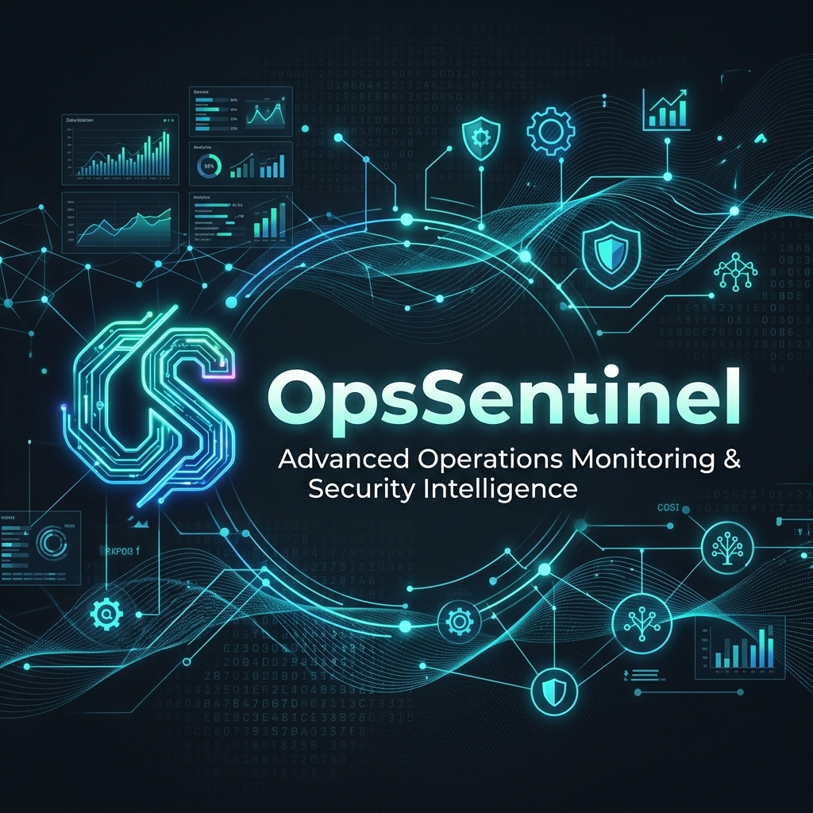

<p align="center">
  
</p>

<h1 align="center">OpsSentinel</h1>

<p align="center">
  <strong>The open-source, GitHub-native CI/CD observability platform for real-time failure insights.</strong>
</p>

<p align="center">
  <a href="https://github.com/hacrex/OpsSentinel/stargazers"></a>
  <a href="https://github.com/hacrex/OpsSentinel/network/members"></a>
  <a href="https://github.com/hacrex/OpsSentinel/blob/main/LICENSE"></a>
  <a href="https://hub.docker.com/"></a>
</p>

---

## Why OpsSentinel?

In the fast-paced world of DevOps, visibility is everything. **OpsSentinel** stops the madness of digging through scattered GitHub Action logs. It provides a centralized, high-density dashboard that highlights pipeline health across all your repositories in real-time.

- **Stop Proactive Polling**: Let the dashboard tell you when something is wrong.
- **Zero Configuration**: Connect via webhooks and you're live in minutes.
- **Instant Alerts**: Failure notifications directly to Slack, Teams, or your Inbox.

---

## Features

-  **Real-Time Tracking**: Listens to GitHub `workflow_run` events to track pipeline states as they change.
-  **Centralized Dashboard**: A high-density UI designed for DevOps "Command Centers".
-  **Multi-Channel Alerting**: Instant notifications via **Email**, **Slack**, and **Microsoft Teams**.
-  **Secure by Design**: Webhook verification via HMAC SHA256 and GitHub OAuth integration.
-  **Flexible Backend**: Default SQLite for local dev, PostgreSQL for production.
-  **Docker Native**: Deploy the entire stack with a single `docker-compose up`.

---

## Tech Stack

| Component | Technology |
|---|---|
| **Frontend** | React, Vite, Lucide, Recharts |
| **Backend** | Node.js, Express, WebSocket |
| **Database** | SQLite / PostgreSQL |
| **Infrastructure** | Docker, GitHub Webhooks, GitHub OAuth |

---

##  Quick Start (3 Minutes)

The easiest way to get started is using Docker Compose.

1. **Clone the repository**
   ```bash
   git clone https://github.com/hacrex/OpsSentinel.git
   cd OpsSentinel
   ```

2. **Setup Environment**
   ```bash
   cp .env.example .env
   # Fill in GITHUB_CLIENT_ID & GITHUB_CLIENT_SECRET
   ```

3. **Ignition!**
   ```bash
   docker-compose up -d --build
   ```

Visit `http://localhost` to see your dashboard in action! 🚀

---

##  Roadmap

- [ ] **AI-Powered Root Cause Analysis**: LLM integration to summarize why a build failed.
- [ ] **Flaky Test Shield**: Identify and isolate unreliable tests automatically.
- [ ] **Predictive Alerting**: Forecast potential failures based on historical trends.
- [ ] **Browser Extension**: Real-time status in your browser toolbar.

---

## 🤝 Contributing

We ❤️ open source! Whether you're fixing a bug, adding a feature, or improving documentation, your contributions are welcome.

Check out our [Contributing Guide](CONTRIBUTING.md) to get started.

### Good First Issues
Look for the `good first issue` label in our [Issue Tracker](https://github.com/hacrex/OpsSentinel/issues).

---

## ⭐ Show Your Support

If you find OpsSentinel useful, please consider giving it a ⭐ on GitHub! It helps more developers discover the tool and motivates us to keep building.

---

## 📄 License

This project is licensed under the MIT License - see the [LICENSE](LICENSE) file for details.

<p align="center">
  Built with ♾️ by the OpsSentinel Team.
</p>
