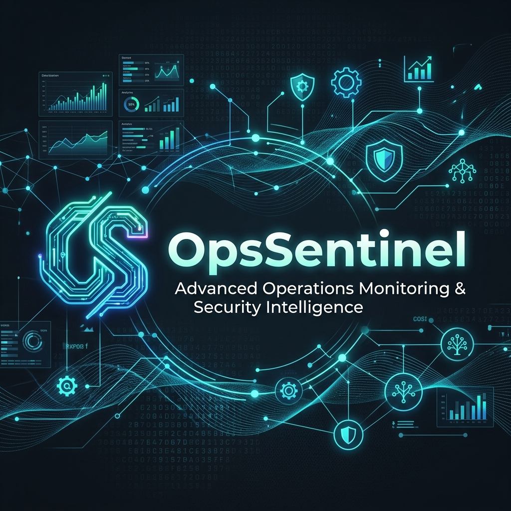

<p align="center">
  
</p>

<h1 align="center">OpsSentinel</h1>

<p align="center">
  <strong>The open-source, GitHub-native CI/CD observability platform for real-time failure insights.</strong>
</p>

<p align="center">
  <a href="https://github.com/hacrex/OpsSentinel/stargazers"></a>
  <a href="https://github.com/hacrex/OpsSentinel/network/members"></a>
  <a href="https://github.com/hacrex/OpsSentinel/blob/main/LICENSE"></a>
  <a href="https://hub.docker.com/"></a>
</p>

---

## Why OpsSentinel?

In the fast-paced world of DevOps, visibility is everything. **OpsSentinel** stops the madness of digging through scattered GitHub Action logs. It provides a centralized, high-density dashboard that highlights pipeline health across all your repositories in real-time.

- **Stop Proactive Polling**: Let the dashboard tell you when something is wrong.
- **Zero Configuration**: Connect via webhooks and you're live in minutes.
- **Instant Alerts**: Failure notifications directly to Slack, Teams, or your Inbox.

---

## Features

- **Real-Time Tracking**: Listens to GitHub `workflow_run` events via WebSockets for instant dashboard updates without polling.
- **Centralized Dashboard**: A high-density UI designed for DevOps "Command Centers" with filtering by repository and conclusion status.
- **Repo Analytics**: Per-repository stats including success rate, MTTR (Mean Time To Recovery), and 30-day failure trend charts.
- **Flaky Workflow Detection**: Automatically identifies workflows with >30% failure rate across 5+ runs.
- **1-Click Re-run**: Trigger workflow re-runs directly from the dashboard via GitHub API.
- **Multi-Channel Alerting**: Instant notifications via **Email**, **Slack**, and **Microsoft Teams**.
- **Secure by Design**: Webhook verification via HMAC SHA256 and GitHub OAuth integration.
- **Flexible Backend**: Default SQLite for local dev, PostgreSQL for production.
- **SaaS Ready**: Multi-tenant mode with per-tenant webhook secrets and data isolation.
- **Data Retention**: Automatic cleanup of old events via configurable retention policy.
- **Docker Native**: Deploy the entire stack with a single `docker-compose up`.

---

## Tech Stack

| Component | Technology |
|---|---|
| **Frontend** | React 19, Vite, Lucide, Recharts |
| **Backend** | Node.js, Express, WebSocket, Helmet |
| **Database** | SQLite (dev) / PostgreSQL (prod) |
| **Auth** | GitHub OAuth |
| **Notifications** | Nodemailer, Slack Webhooks, Teams Webhooks |
| **Infrastructure** | Docker Compose, NGINX |

---

## Project Structure

```
OpsSentinel/
├── backend/          # Node.js Express API server
├── frontend/         # React dashboard application
├── website/          # Marketing/landing page website (separate)
├── docker-compose.yml
└── .env.example
```

---

## Quick Start (3 Minutes)

The easiest way to get started is using Docker Compose.

1. **Clone the repository**
   ```bash
   git clone https://github.com/hacrex/OpsSentinel.git
   cd OpsSentinel
   ```

2. **Setup Environment**
   ```bash
   cp .env.example .env
   # Fill in GITHUB_CLIENT_ID & GITHUB_CLIENT_SECRET
   ```

3. **Ignition!**
   ```bash
   docker-compose up -d --build
   ```

Visit `http://localhost` to see your dashboard in action!

### Running Tests

```bash
# Backend tests
cd backend && npm test

# Frontend tests
cd frontend && npm test
```

### Environment Variables

| Variable | Required | Description |
|----------|----------|-------------|
| `GITHUB_CLIENT_ID` | Yes | GitHub OAuth App Client ID |
| `GITHUB_CLIENT_SECRET` | Yes | GitHub OAuth App Client Secret |
| `GITHUB_WEBHOOK_SECRET` | Yes | Secret for webhook signature verification |
| `FRONTEND_URL` | No | CORS origin (default: `http://localhost:5173`) |
| `DATABASE_URL` | No | PostgreSQL connection string (uses SQLite if omitted) |
| `RETENTION_DAYS` | No | Days to keep events (default: `30`) |
| `SLACK_WEBHOOK_URL` | No | Slack incoming webhook URL |
| `TEAMS_WEBHOOK_URL` | No | Microsoft Teams incoming webhook URL |
| `ALERT_EMAIL_TO` | No | Email recipient for failure alerts |
| `SMTP_HOST` | No | SMTP server host |
| `SMTP_PORT` | No | SMTP server port (default: `587`) |
| `SMTP_USER` | No | SMTP username |
| `SMTP_PASS` | No | SMTP password |
| `SAAS_MODE` | No | Enable multi-tenant mode (`true`/`false`) |
| `BYPASS_AUTH` | No | Skip auth for local dev (`true`/`false`) |

---

## Roadmap

- [ ] **AI-Powered Root Cause Analysis**: LLM integration to summarize why a build failed.
- [ ] **Predictive Alerting**: Forecast potential failures based on historical trends.
- [ ] **GitLab & Bitbucket Support**: Extend beyond GitHub Actions.
- [ ] **RBAC**: Role-Based Access Control (Viewer, Developer, Admin).
- [ ] **SSO/SAML**: Enterprise login integration (Okta, Google Workspace).
- [ ] **Browser Extension**: Real-time status in your browser toolbar.

---

## Contributing

We love open source! Whether you're fixing a bug, adding a feature, or improving documentation, your contributions are welcome.

Check out our [Contributing Guide](CONTRIBUTING.md) to get started.

### Good First Issues
Look for the `good first issue` label in our [Issue Tracker](https://github.com/hacrex/OpsSentinel/issues).

---

## Show Your Support

If you find OpsSentinel useful, please consider giving it a star on GitHub! It helps more developers discover the tool and motivates us to keep building.

---

## License

This project is licensed under the MIT License - see the [LICENSE](LICENSE) file for details.

<p align="center">
  Built with ❤️ by the OpsSentinel Team.
</p>
